# 1. 数据导入

## (1)	NIFTI格式导入

点击工具栏的"导入"按钮，选择NIFTI格式的PET和CT数据文件。软件将自动将PET转换为SUV数据，配准到CT，并与CT融合显示。

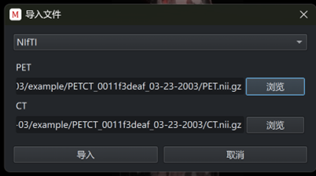

## (2)	DICOM格式导入

软件同样支持DICOM格式数据的导入。当导入DICOM数据时，软件会自动读取并显示患者信息，包括患者姓名、患者ID、性别、体重等。

## (3)	导入标注数据

导入数据后，还可以导入对应的标注数据进行查看和编辑。

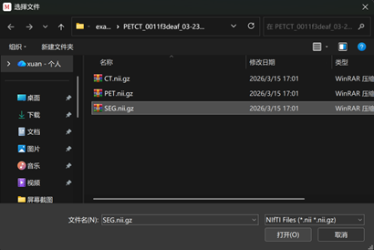

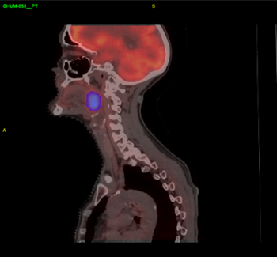

# 2. 图像查看与调整

## (1)	窗宽窗位调整

在图像设置区的CT设置中，可以调整图像的窗宽窗位。也可以点击预设窗按钮使用PET/CT常用的预设窗。在工具栏选择"调窗"功能后，可通过鼠标在图像显示区移动来调整窗宽窗位。

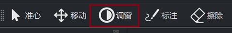\

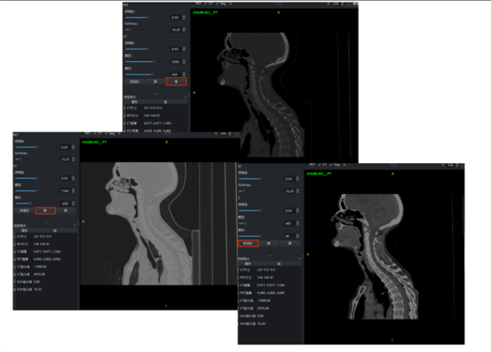

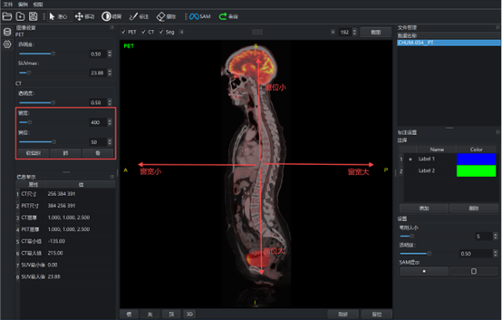

## (2)	透明度调整

在图像设置中，可分别对PET和CT进行透明度设置，以便更好地观察融合图像。还可以调整PET的SUV最大值显示范围。

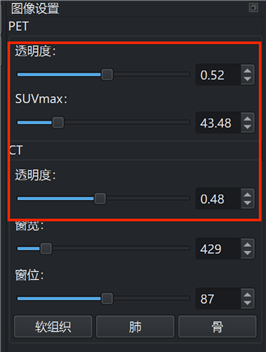

## (3)	视图切换

点击下方按钮可切换三方位视图：横断面、矢状面、冠状面。可对标注后的数据进行3D重建显示。

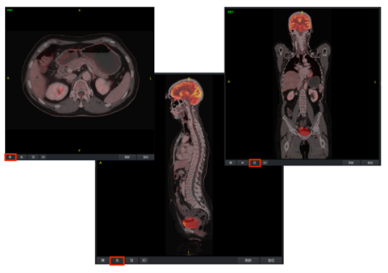

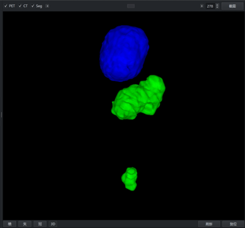

## (4) 鼠标操作控制

图像显示区支持以下鼠标操作：

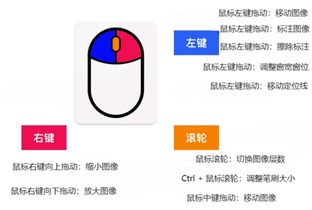

图像可在窗口中进行复位处理，恢复默认大小和位置。

# 3. 标注操作

## (1)	手动标注

在工具栏点击"标注"按钮进入标注模式。选中需要标注的Label，即可在图像上进行标注。可对Label进行重命名和颜色切换。
在标注模式下，使用鼠标滚轮可切换当前层。

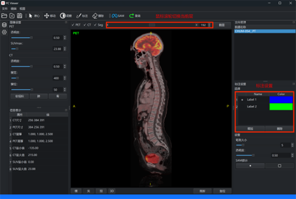

## (2)	笔刷大小调整

当处于标注或擦除状态时，可通过 Ctrl + 鼠标滚轮 调整笔刷大小，也可在标注设置处直接设置笔刷大小。

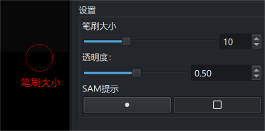

## (3)	擦除标注

在工具栏点击"擦除"按钮进入擦除模式，可擦除标注错误的区域。

## (4)	删除所有标注

点击工具栏的"重做"按钮可删除当前所有标注。

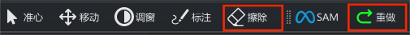

## (5)	SAM半自动分割

SAM（Segment Anything Model）是一种通用的图像分割模型，可实现半自动标注功能：

添加新Label：在标注管理中添加新的Label用于存储分割结果。

框提示标注：选中SAM后，在图像上绘制矩形框，模型将自动分割框内区域。

点提示标注：在目标区域点击，模型将根据点的位置进行分割。提示部分只需大概位置即可。

删除标注：可以对SAM生成的标注进行删除。

标注透明度可在设置中调整，以便更好地观察标注与原图的融合效果。

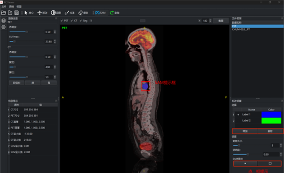

# 4. 数据管理与保存

## (1)	文件管理

在侧栏的文件管理处可以快速导入其他数据，可对已导入的数据进行删除或重命名操作。

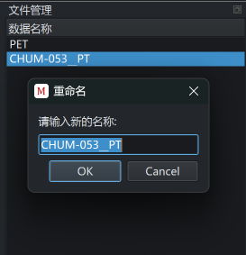

## (2)	标注数据保存

标注完成后，可对标注数据进行保存。重新导入数据后，可以将对应的标注数据导入查看和编辑。

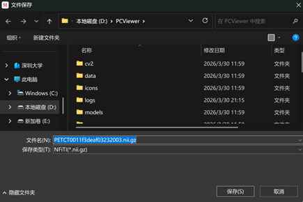

## (3)	截屏保存

可对当前显示的图像进行截屏保存。
