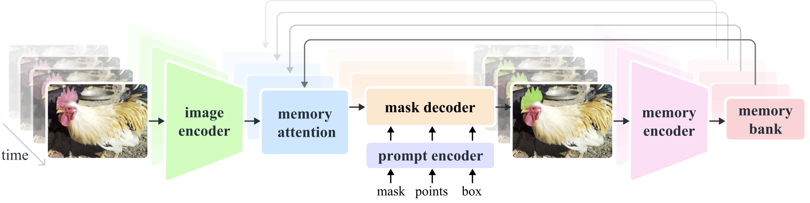
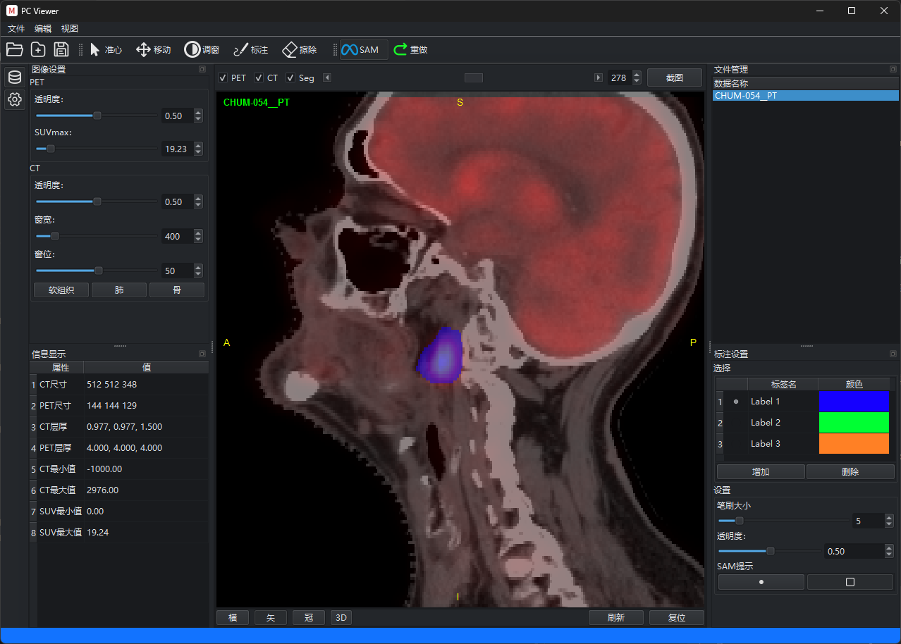

# PCViewer

[](https://www.python.org/) [](https://doc.qt.io/qtforpython/) [](LICENSE)

PCViewer 是一款PET/CT图像全身病灶分割软件，提供了影像分析、分割和管理功能。



---

## 主要功能

- **文件管理**：支持导入、重命名、删除PET/CT数据
- **图像查看**：支持横断面、矢状面、冠状面和3D视图
- **图像分割**：支持手动绘制和SAM（Segment Anything Model）自动分割
- **数据存储**：将导入的文件路径记录到YAML配置文件
- **实时反馈**：运行SAM时显示进度弹窗



---

## 环境要求

- Python 3.12+

### 使用pip安装

```bash
pip install -r requirements.txt
```

### 使用uv

```bash
uv sync
```

### 使用前先下载onnx模型

将[sam2.1_hiera_base_plus](https://huggingface.co/mabote-itumeleng/ONNX-SAM2-Segment-Anything/tree/main)放到models/checkpoints下即可

### 运行软件

```bash
python main.py
```

---

## 开源协议

本项目采用 **Apache License 2.0** 开源协议。
在遵守许可证条款的前提下，允许自由使用、修改和分发。

---

## 免责声明

本软件仅用于科研与教学目的，
不作为临床诊断或治疗决策的直接依据。

---


# 参考:

SAM2 Repository: https://github.com/facebookresearch/segment-anything-2

ONNX-SAM2-Segment-Anything: https://github.com/ibaiGorordo/ONNX-SAM2-Segment-Anything

---
